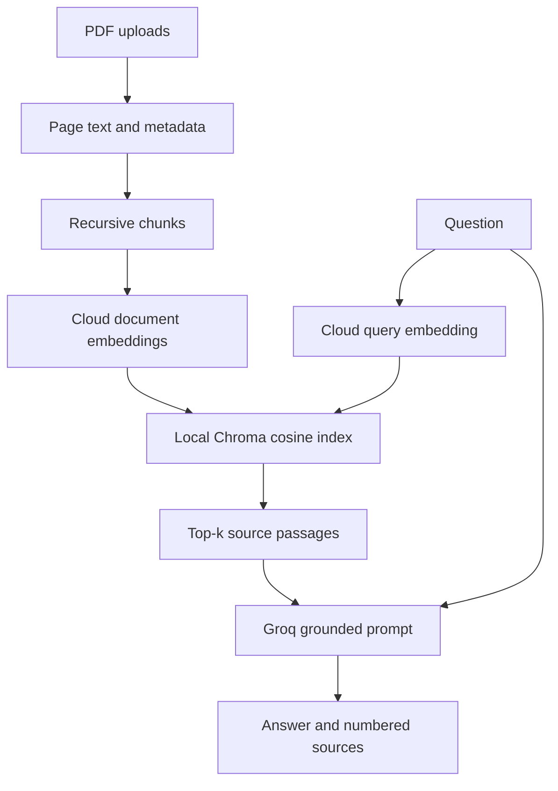

# Ask Your PDFs — RAG Document Q&A

Live demo: <https://awanish-ask-your-pdfs.streamlit.app/>

A Streamlit demo that extracts selectable PDF text, retrieves relevant passages,
and asks Groq to answer with numbered document/page/chunk sources.
No GPU or Docker. Default AI inference runs in cloud APIs. ChromaDB stores data
locally. This is a student/demo application, not an authenticated public service.

## Review status

See `REVIEW_REPORT.md` for the fixes, test results, and remaining limitations.
Offline tests use real pypdf, LangChain splitting and persistent ChromaDB, with
fake embeddings and fake LLM responses. They do **not** establish live semantic
retrieval accuracy, hallucination resistance, or provider/account availability.

## Windows setup (Command Prompt)

Extract this version to a fresh folder. Do not copy an old `.venv` or Chroma index.
Python 3.11/3.12 is recommended; this revision was tested on Linux Python 3.12.

```bat
cd rag-doc-qa
py -3.12 -m venv .venv
.venv\Scripts\activate
python -m pip install -r requirements.txt
copy .env.example .env
```

If you use Python 3.11, replace `py -3.12` with `py -3.11`.
Edit `.env` locally and fill in:

- `GROQ_API_KEY`: your existing Groq key.
- `COHERE_API_KEY`: a separate **free evaluation key** from
  <https://dashboard.cohere.com/api-keys> for cloud embeddings.

Then run:

```bat
python -m pip check
python -m streamlit run app.py
```

Open the printed localhost URL. Select PDFs, click **Index documents**, then ask
an explicit question. Source `[1]` in the answer maps to `[1]` in Retrieved sources.

On macOS/Linux use `python3 -m venv .venv`, `source .venv/bin/activate`, and
`cp .env.example .env`; the remaining Python commands are the same.

### Why a second key?

Generation and embeddings are different operations. This project uses Groq for
text generation and Cohere for embeddings. The original local MiniLM approach
runs an AI model on your laptop and installs PyTorch, so it does not meet the
original cloud-only constraint.

Cohere documents free, usage-limited evaluation keys (currently 1,000 calls/month;
Embed also has per-minute input limits). Use an evaluation key for this demo,
not a paid production key. Account eligibility, quotas and model access must be
verified on your account; the app does not buy credits or enable billing.
Re-indexing and asking questions both use embedding quota.

Hugging Face is not the default: its current pricing page lists no included
credits for free users. Earlier guidance about free HF credits is outdated.

### Optional original local mode

Only if you deliberately accept local CPU inference:

```bat
python -m pip install -r requirements-local.txt
```

Set `EMBEDDING_BACKEND=local` in `.env`, then restart Streamlit. It uses
`LOCAL_EMBEDDING_MODEL=sentence-transformers/all-MiniLM-L6-v2` and does not need
Cohere credentials. This downloads model weights and PyTorch. Local mode is
optional and was not live-tested during this review. Cloud mode does not import
sentence-transformers or run/download model weights. Chroma's dependencies still
include vector-processing/native libraries; the overall install is not tiny.

## Architecture



1. **Ingestion:** pypdf extracts each page, keeping its physical 1-based page
   number. Blank/image-only pages are skipped; a PDF with no extractable text is
   rejected. No OCR or reliable reconstruction of complex tables is included.
2. **Chunking:** `RecursiveCharacterTextSplitter` uses paragraphs, lines, spaces,
   then characters. Defaults are 1,000 characters and up to 200 characters of
   overlap. Actual overlap depends on separators. These are starting values,
   not empirically optimal settings. They are configurable in `.env`.
3. **Embeddings:** Cohere `embed-english-light-v3.0` creates 384-dimensional
   vectors. Documents use `search_document`; questions use `search_query`.
   This configuration targets English documents/questions.
4. **Storage:** Chroma explicitly uses cosine distance and receives vectors
   supplied by our adapter. The embedding identity is stored; changing models
   cannot silently mix incompatible vectors. Index updates use a staging
   collection and only switch the active manifest after every batch succeeds.
5. **Retrieval:** top-k defaults to 4, capped to the index size. This finds nearest
   passages; their presence does not prove an answer exists. There is no calibrated
   relevance threshold, hybrid search or reranker in this version.
6. **Generation:** Groq receives only the question and retrieved excerpts, with
   instructions to ignore document-embedded commands and refuse unsupported
   answers. Output must contain valid source IDs or the exact refusal. This
   syntactic check does not prove each claim is supported by its citation.

## Files

| File | Role |
|---|---|
| `app.py` | Streamlit upload/chat UI and session state |
| `src/ingest.py` | PDF extraction and input checks |
| `src/chunk.py` | Page-preserving recursive splitting |
| `src/embeddings.py` | Cloud embedding API; optional lazy local backend |
| `src/embed_store.py` | Cosine search, persistence, staged replacement |
| `src/retrieve.py` | Retrieval and numbered context formatting |
| `src/generate.py` | Groq call, grounding prompt and citation-ID checks |
| `src/service.py` | Upload validation and readable error handling |
| `verify_live.py` | Opt-in real-provider sample acceptance check |
| `tests/` | Offline regression tests and sample PDF generator |

## Index and chat behavior

- **Index documents replaces the complete active corpus** with the currently
  selected PDFs. Select all PDFs you want searched together. This removes chunks
  from removed documents or older versions of the same filename.
- A failed extraction or embedding batch leaves the previous active index intact.
  Successfully replacing the corpus resets chat to avoid showing old answers
  against new documents. Clear index also resets chat.
- Every browser session gets a random workspace under `chroma_db/`. Sessions do
  not share one cached store. This is isolation for a local demo, not authentication.
- Chroma persists on disk, but a browser reload/new session may start a new empty
  workspace. Automatic reopening of prior UI sessions is not implemented.
  Programmatic reopening of the same workspace is tested.
- Uploaded PDFs are parsed in memory, not saved using their filenames. Extracted
  text and metadata persist in Chroma. After stopping the app, delete `chroma_db/`
  to remove all sessions' local indexes. Clear index removes the current active
  collection, not an audited secure erasure of storage/backups.
- Chat history is display-only. Retrieval does not resolve pronouns from earlier
  messages. Ask “What is SolarX's warranty?” rather than “What about its warranty?”
- Limits: 10 PDFs; each at most 20 MB and 200 pages; at most 2,000 chunks per
  indexing operation; questions at most 2,000 characters in the UI.
- One writer per workspace. Crashed staging operations may leave an inactive
  collection on disk, but it is not selected as the active corpus.

## Configuration

| Variable | Default / purpose |
|---|---|
| `GROQ_API_KEY` | Required for answers |
| `GROQ_MODEL` | `openai/gpt-oss-120b`; account access required |
| `EMBEDDING_BACKEND` | `cloud`; optional `local` |
| `COHERE_API_KEY` | Evaluation key required for cloud embeddings |
| `EMBEDDING_MODEL` | `embed-english-light-v3.0` for cloud mode |
| `LOCAL_EMBEDDING_MODEL` | `sentence-transformers/all-MiniLM-L6-v2` |
| `CHUNK_SIZE` | `1000` characters |
| `CHUNK_OVERLAP` | `200` characters, must be less than chunk size |
| `RAG_STORAGE_DIR` | Optional absolute base folder for session indexes |

Restart the app after editing `.env`. Existing shell environment variables take
precedence over `.env`. Never commit real keys. Changing embedding model requires
re-indexing in a new workspace.

Groq retired Llama 3.3 70B for free/developer accounts on August 16, 2026.
The default is now `openai/gpt-oss-120b`. If you previously set `GROQ_MODEL`
in hosting secrets, update it to this model or remove that override. Model
availability and free quota depend on your account; no billing is enabled by this app.
See <https://console.groq.com/docs/deprecations>.

## Tests

```bat
python -m pip install -r tests/requirements-test.txt
python -m pytest -q
```

The default suite needs no API keys and uses mocked cloud calls. PDF parsing,
chunking, Chroma storage/search/persistence and Streamlit AppTest execution are
real. Keyword-based test vectors only verify data flow/ranking mechanics, not
semantic model quality. Direct dependencies are pinned; transitive dependencies
are resolved by pip, not fully locked across operating systems.

To run real provider checks after setting your keys:

```bat
python verify_live.py --live
```

This generates a synthetic three-page PDF, embeds it, checks two known facts and
one absent fact, and makes actual Groq calls. It consumes quota. It prints the
temporary folder; delete that folder after the process exits. It does not touch
the UI index. A successful sample is not a general accuracy guarantee.

## Manual acceptance checklist

1. Upload the generated sample PDF or a small selectable-text PDF. Verify page
   citations and expand the full source excerpt.
2. Ask a known fact, a paraphrase, a cross-document question, and a question whose
   answer is absent. Inspect evidence, not just plausible wording.
3. Re-index a shorter revised PDF with the same filename. Old pages must disappear.
4. Upload a corrupt, password-protected, and image-only PDF. Each should give a
   readable error while preserving the existing index.
5. Open an independent browser session. Its index should start empty; clearing it
   must not clear the first session's index.
6. Confirm missing/invalid keys or quota failures show an error without crashing.
7. Put a misleading instruction in a test document and check that answers still
   follow the system rules. Prompt defenses reduce risk but are not a guarantee.

## Resume bullets (no invented accuracy numbers)

- Built a PDF question-answering application using Python, Streamlit, cloud
  embeddings, ChromaDB and Groq, with document/page/chunk source references.
- Implemented page-preserving recursive chunking, cosine top-k retrieval and
  staged index replacement to prevent stale chunks after document updates.
- Added automated regression tests covering PDF edge cases, persistence, session
  isolation, API failures and citation-reference validation.

## Interview questions

1. **What is RAG?** Retrieve relevant evidence, then give it to an LLM with the
   question. It provides external context without updating model weights.
2. **Why not paste the whole PDF?** Focused retrieval can reduce repeated input
   and scale to multiple documents; short documents may work well with direct
   prompting. Retrieval can also miss evidence.
3. **Why 1000/200?** A configurable character-based starting point balancing
   passage context and search precision. Tune against representative questions
   and model token limits; overlap is not guaranteed to equal 200 each time.
4. **What do embeddings do?** Encode meaning as vectors. Query and documents use
   the same model/space, with the appropriate retrieval input types.
5. **How is relevance ranked?** Chroma uses cosine distance. Top-k returns nearest
   passages, not a guarantee that they answer the question.
6. **Does RAG stop hallucinations?** No. Grounding instructions, refusal behavior
   and citation checks reduce some failures. Claim-level verification still needs
   evaluation and human/source inspection.
7. **What happens on re-upload?** The selected corpus is staged and activated only
   after success, so older chunks disappear and failed updates preserve the old index.
8. **How would you scale it?** Add authenticated document ownership, ingestion
   workers, versioned storage, embedding caching, hybrid retrieval, reranking and
   a labeled evaluation set; benchmark before choosing infrastructure.

## Deploy to Streamlit Community Cloud

Repository: <https://github.com/awanishmishra642-commits/rag-doc-qa>

1. Sign in at <https://share.streamlit.io/> and choose **Create app**.
2. Select repository `awanishmishra642-commits/rag-doc-qa`, branch `main`,
   and entrypoint `app.py`.
3. Open **Advanced settings**, select **Python 3.12**, and add these root-level
   TOML secrets with your own keys:

```toml
GROQ_API_KEY = "your_groq_key"
COHERE_API_KEY = "your_cohere_evaluation_key"
EMBEDDING_BACKEND = "cloud"
EMBEDDING_MODEL = "embed-english-light-v3.0"
GROQ_MODEL = "openai/gpt-oss-120b"
```

4. Save and deploy. Wait for dependency installation and the app page to load.
   If the selected Groq model is unavailable to your account, update `GROQ_MODEL`
   in the app's secrets to a model your account supports and reboot.
5. Download `tests/fixtures/sample.pdf` from this repository and upload it to the
   running app. Index it, ask a known fact from the PDF, and verify the answer
   against the expanded page citation. Also ask something absent from the PDF
   and check that the app refuses to invent an answer.

Streamlit exposes root-level secrets as environment variables, which this app
reads. Keep keys in the hosting secrets panel; never put real keys in this
README or commit `.env` / `.streamlit/secrets.toml`.

The hosted demo uses the owner's provider quotas. Uploaded text goes to Cohere
and retrieved excerpts go to Groq. Use sample/non-sensitive documents for public
demos. Local Chroma files on the host are not durable backups; restarting or
redeploying can require re-uploading and indexing. New browser sessions start
empty. This demo does not provide user authentication or abuse protection.

Official deployment and secrets instructions:
<https://docs.streamlit.io/deploy/streamlit-community-cloud/deploy-your-app/deploy>
and <https://docs.streamlit.io/deploy/streamlit-community-cloud/deploy-your-app/secrets-management>.

## GitHub push (after local verification)

```bat
git init
git add .
git status
```

Check that `.env`, uploads, virtual environments and indexes are absent from the
staged files. Then:

```bat
git commit -m "Build tested PDF RAG demo"
git branch -M main
git remote add origin https://github.com/awanishmishra642-commits/rag-doc-qa.git
git push -u origin main
```

## Official references checked during review

- Chroma distance configuration: <https://docs.trychroma.com/docs/collections/configure>
- Cohere embeddings/API: <https://docs.cohere.com/v2/reference/embed>
- Cohere models: <https://docs.cohere.com/docs/cohere-embed>
- Cohere evaluation limits: <https://docs.cohere.com/docs/rate-limits>
- Groq models: <https://console.groq.com/docs/models>
- HF pricing correction: <https://huggingface.co/docs/inference-providers/en/pricing>
